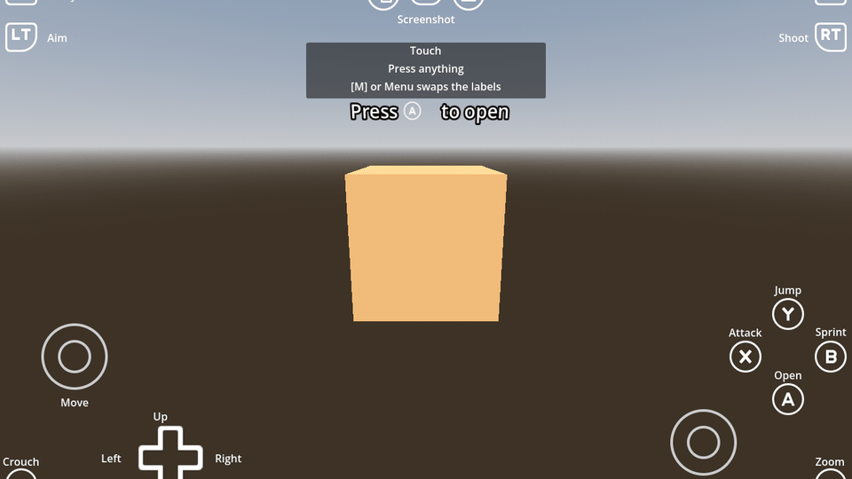

# Controls

On-screen input hints for Godot 4.8. A `CanvasLayer` that shows which button does what, redraws itself in the
art of whatever device is being played on - keyboard and mouse, Xbox, Switch, PlayStation, touch - and swaps
its labels as the game changes what the buttons mean. It comes with a world-space "Press [button] to ..."
prompt to hang on anything the player can walk up to.

Nothing in it knows what your game is. Every button is a slot with an action name of its own, exported so you
map it in the inspector, so the same HUD serves a platformer, a driving game or a menu.

## Playing the demo

The demo runs in a browser at <https://timothycope.com/godot-controls/>. A GitHub Action exports it on every
push to `main` and hands it straight to Pages, so the export itself is never committed: the projects that use this
addon fetch it with a script, and a web export is tens of megabytes that git cannot compress.

## Installing

Copy the repository to `addons/controls/` in your project, or take it as a submodule, which is how the
projects here consume it:

```powershell
git submodule add https://github.com/kirbycope/godot-controls.git addons/controls
```

The folder has to be `addons/controls` whatever the repository is called, because the scenes reference their
own art by `res://addons/controls/...`. Then enable **Controls** in Project Settings, Plugins - the scripts
register their class names on their own, so the plugin only adds the world prompt to the Create New Node
dialog.

Drop `addons/controls/controls.tscn` into your scene as a child of whatever owns the screen, and hang
`addons/controls/action_prompt.tscn` on anything interactable.

## Mapping the buttons

Every slot on the HUD is an exported action name, grouped in the inspector by where the button is:

| Group | Slots | Default |
| --- | --- | --- |
| Face Button Actions | `action_button_0`, `action_button_1`, `action_button_3` | `ui_accept`, `ui_cancel`, `ui_select` |
| Face Button Actions | `action_button_2` | blank |
| Shoulder and Trigger Actions | `action_button_9`, `action_button_10`, `action_axis_4_plus`, `action_axis_5_plus` | blank |
| Stick Actions | `action_move_up`, `action_move_down`, `action_move_left`, `action_move_right` | `ui_up`, `ui_down`, `ui_left`, `ui_right` |
| Stick Actions | `action_look_*`, `action_button_7`, `action_button_8` | blank |
| D-Pad Actions | `action_button_11` to `action_button_14` | `ui_up`, `ui_down`, `ui_left`, `ui_right` |
| System Button Actions | `action_button_4`, `action_button_6` | blank |
| System Button Actions | `action_button_15` | `take_screenshot` |

The defaults are Godot's own actions wherever the engine already binds that physical button, so a project that
has never defined an action of its own still gets a working HUD: the face buttons drive accept, cancel and
select, and the d-pad, the left stick and WASD drive the four directions. A slot the engine does not bind but
the key face names still gets that key: `F5` for View, `Esc` for the pause button and `PrtScn` for Screenshot.

Two rules follow from that table.

**A blank slot is a button your game does not use, and it is hidden.** That is why the left face button, the
shoulders, the triggers and the right stick are absent until you map them. A HUD that shows a Throw button for
a game with no throwing is worse than no HUD.

That hiding happens in the editor as well as in the running game, so the scene shows what ships rather than
every button the HUD owns. Only the visibility is previewed: no action is registered, no texture is swapped
and nothing is written to a button, and a visibility that already matches is left alone so an untouched scene
is not marked modified. Map or blank a slot in the inspector and its button appears or disappears as you type.

The share button is the exception, and the next section says why.

## Picking from a list the game published

A slot's action is free text, which suits a game that declares its own actions. A game that only ever answers
to a fixed list - an engine or an emulator wrapped as a GDExtension, which reads the InputMap and nothing else
- can hand that list over instead, and the slots become a picker of it:

```gdscript
controls.input_catalog = preload("res://addons/some_game/some_game_inputs.tres")
```

`ControlsInputCatalog` is a resource with one field, `actions`. Set `input_catalog` on the HUD and every
`action_*` export turns into a dropdown of those names, plus a blank choice, so a slot cannot quietly name an
action the game has never heard of. Leave it unset and nothing changes.

That is the whole of it, and it is deliberately thin: the HUD does not learn what any of those actions mean,
and the game does not learn that the HUD exists. It is the same slot mechanism, with the typing taken out.

**A slot you name yourself is registered for you.** Set `action_button_2` to `attack` and the addon adds an
`attack` action bound to the face button it is drawn on, so the addon is a drop-in and needs no `project.godot`
edits. An action your project already declared is left exactly as it is, bindings and all, because those are
your business.

Some actions want more than the button they are drawn on - a keyboard key behind a face button, a mouse button
behind a trigger. Those go in `extra_actions`, which the HUD registers before it fills the gaps itself. The
node reads it in `_ready`, and a child is ready before its parent, so set it from the parent's `_enter_tree`:

```gdscript
func _enter_tree() -> void:
	($Controls as Controls).extra_actions = {
		"attack": {"keys": [KEY_F]},
		"shoot": {"mouse": [MOUSE_BUTTON_LEFT]},
	}
```

A binding takes `keys` (physical keycodes), `keycodes` (logical ones), `buttons` (joypad buttons), `axes`
(`[axis, value]` pairs), `mouse` (mouse buttons) and `deadzone`. A subclass sets `extra_actions` in its own
`_ready` before calling `super()` instead.

## Screenshots

The share button - Xbox Share, Nintendo Capture, PlayStation Create, `PrtScn` on a keyboard - is the one slot
the HUD fills in and acts on itself. Every other button is a question for your game; capturing the screen is
not. It is also the one button the HUD names, and the only label that does not start blank: it takes a
screenshot on every device, so the label stays "Screenshot" and the art is what changes. Name it yourself
if your game has a better word for it.

The art follows the binding rather than the vendor's marketing. The slot is `JOY_BUTTON_MISC1`, which SDL -
and so Godot - documents as "Xbox Series X share button, PS5 microphone button, Nintendo Switch Pro capture
button". So PlayStation shows the **mute** button, because that is the one that fires: Create is
`JOY_BUTTON_BACK`, which is the View slot. Nintendo shows `switch_button_sync` only because the icon set
ships no capture glyph; that one is still wrong and wants art.

Pressing it saves a PNG of what is on screen, with the HUD left out of the picture, and emits
`screenshot_taken`. Off the web the file lands in `user://screenshots/`. On the web it cannot: `user://` there
is a browser storage sandbox with no folder behind it and nothing the player can open, so the bytes go to the
page through `JavaScriptBridge.download_buffer` as a download, which is the one way a browser lets a file
reach the machine. That is what makes it worth having in the addon rather than in each game: every web demo
built on this HUD gets a working screenshot button without writing any of it.

```gdscript
controls.screenshot_taken.connect(func(path: String) -> void: print("saved ", path))
await controls.take_screenshot()   # or call it yourself, from a menu
```

Set `takes_screenshots` to `false` in a project that captures the screen its own way, and the button stays but
the HUD stops acting on it. Blank `action_button_15` and the button goes, like any other slot.

## Labels

Each button carries a `Label` naming what it does right now, and every one of them starts **empty** except
the share button. The HUD cannot know that a button is Jump rather than Attack, so it does not guess: a
project names them, either in its own scene the way the demo does or at runtime as a screen changes. The
share button is named because the HUD is what makes it do anything, and what it does does not vary. `set_labels` writes the ones you name
and clears
the rest, so one call describes one screen:

```gdscript
controls.set_labels({
	controls.joypad_button_0_label: "Select",
	controls.joypad_button_1_label: "Back",
	controls.left_joystick_label: "Navigate",
})
```

Naming a joypad label gets the key that does the same job for free: the d-pad's four labels mirror onto `I`,
`J`, `K` and `L`, and the sticks onto `S` and the down arrow. `reset_labels` puts the scene's own text back -
the text on your instance, so a project that named its buttons in the scene gets those back, not blanks.

`ActionPrompt.show_for(controls, "Pick Up")` names the bottom-action button after what the prompt does, and it
keeps that name through every refresh until `hide_for` gives it back. Only the prompt that claimed the label
can release it, so walking out of one prompt while standing in another leaves the other's label alone.

The prompt reads `message_begin`, the button art, `message_end`, and it spaces those three from the width of
the text rather than from fixed positions: each label is measured, a `glyph_gap` is left either side of the
art, and the row is centred on the node. So "Hit / to pry the lid off the crate" reads as evenly as
"Press / to open", and a side left blank takes its gap with it. The X of all three is the script's to set, so
moving them in the scene does nothing - change the wording, `glyph_gap`, or the node itself.

## Devices

`current_input_type` follows whatever was last used and drives everything: the art on each face button,
shoulder and trigger; whether the sticks and d-pad are shown or WASD and the arrow keys; and which sub-prompt
an `ActionPrompt` shows. It is set from the input events themselves, and `input_type_changed` fires when it
moves, which is what a game listens to when its labels differ per device.

Touch borrows the Xbox art. `rumble(weak, strong, seconds)` rumbles the pad and returns `false` without doing
anything on keyboard or touch.

The keyboard art is exported too, one texture per state per slot, so a project that binds different keys than
the defaults shows its own. The demo does exactly that. That covers the whole keyboard set: the face buttons,
the shoulders and triggers, and also the stick and d-pad keys through `keyboard_mouse_move_*`,
`keyboard_mouse_look_*` and `keyboard_mouse_button_11` to `14`. Those twelve are never swapped per device,
because they are only ever shown for keyboard and mouse, and a pair left blank keeps the key face the scene
already has - so a project on WASD and the arrows sets none of them.

## The demo scene

`scenes/demo/demo.tscn` is a crate with a prompt on it and the HUD mapped to `demo_*` actions that appear
nowhere in `project.godot`, next to a d-pad and left stick left at their Godot defaults, so you can see both
halves at once. Press anything and the button lights up and the readout names the action. `Esc` swaps the labels
for a menu's worth and back.

It is the main scene of the demo project this addon is developed in, and installing the addon brings it, so
you can open it in your own project to see the wiring.

This repository **is** that project. It uses the layout the
[Godot Asset Library](https://docs.godotengine.org/en/stable/community/asset_library/submitting_to_assetlib.html) expects, with the addon at `addons/controls/` and a
`project.godot` at the root, so cloning it and opening it in Godot is all it takes. The
addon is mounted at `res://addons/controls/` exactly as it is in a game, so it is
edited in place with nothing copied first, and the root `project.godot` is skipped as a
conflict when the asset is installed from the library.


## Tests

```powershell
& 'C:\Godot\godot.exe' --headless --path . -s addons/gut/gut_cmdln.gd -gdir=res://addons/controls/tests -gexit
```

## Credits and licenses

| What | Author | License | Source |
| --- | --- | --- | --- |
| `assets/kenney_nl/Icons/Input Prompts/` | Kenney | CC0 1.0 (`License.txt` beside them) | <https://kenney.nl/assets/input-prompts> |
| Everything else | Tim Cope | MIT (`LICENSE`) | |

The HUD and the world prompt were part of
[godot-3d-player-controller-addon](https://github.com/kirbycope/godot-3d-player-controller-addon) before this
repository, and were lifted out of it so projects with no player controller could use them.
